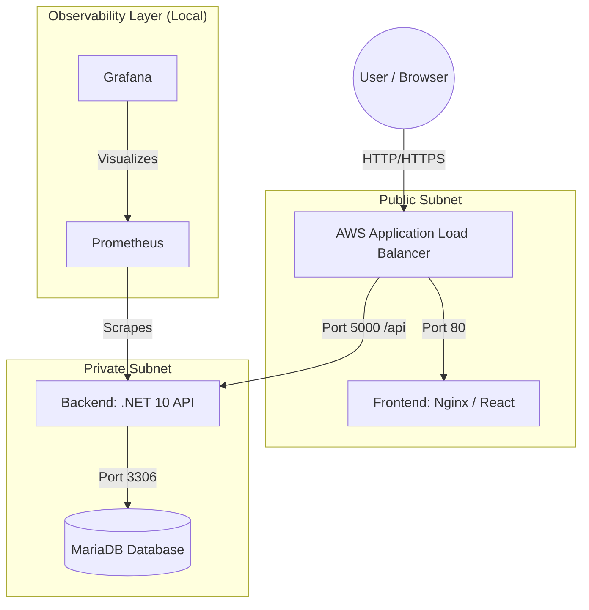
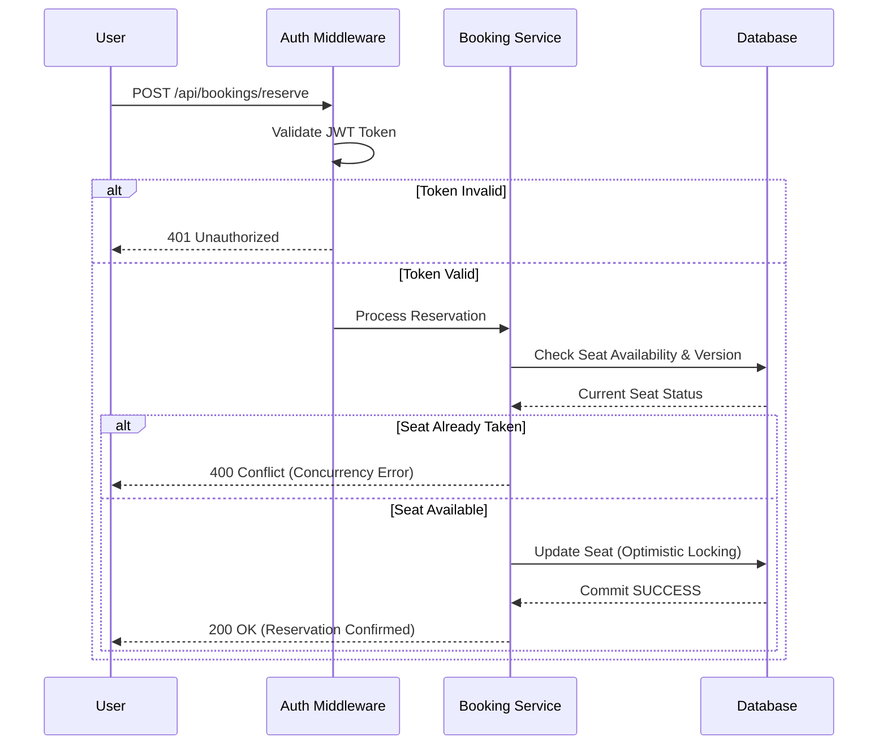
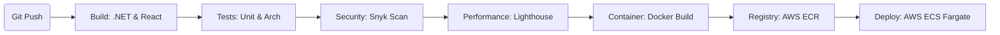
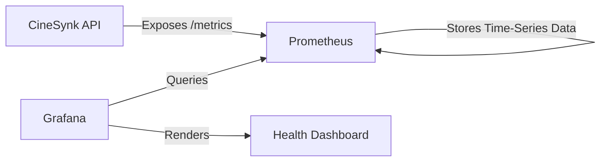

# CineSynk - System Architecture & Data Flow

This document provides a visual and technical breakdown of how CineSynk works, from user interaction to cloud deployment.

---

## 🏗️ 1. High-Level System Architecture
This diagram shows how the user interacts with the system through the Load Balancer and how the services communicate.

---

## 🔄 2. Core Booking Flow (Sequence)
This diagram illustrates the logic lifecycle when a user attempts to reserve a seat. It highlights the security and concurrency checks.

---

## 🤖 3. DevSecOps Pipeline Flow
How your code travels from a `git push` to a live production environment.

---

## 📉 4. Observability Data Flow
How performance metrics are collected and displayed in the local dashboard.

---

## 🛠️ 5. Clean Architecture Layers
The internal structure of the Backend code ensuring maintainability.

- **Presentation:** Controllers & Middlewares (API endpoints).
- **Application:** Services (Business logic & Orchestration).
- **Domain:** Models & DTOs (The "Heart" of the system).
- **Infrastructure:** Data Access (EF Core & Migrations).
